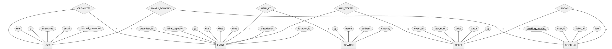
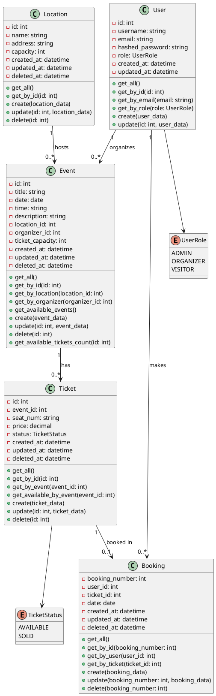

# // ER Diagram

```plantuml
@startchen

entity USER {
  id <<key>>
  username
  email
  hashed_password
  role
}

entity EVENT {
  id <<key>>
  title
  date
  time
  description
  location_id
  organizer_id
  ticket_capacity
}

entity LOCATION {
  id <<key>>
  name
  address
  capacity
}

entity TICKET {
  id <<key>>
  event_id
  seat_num
  price
  status
}

entity BOOKING {
  booking_number <<key>>
  user_id
  ticket_id
  date
}

relationship ORGANIZES {
}
ORGANIZES -1- USER
ORGANIZES -N- EVENT

relationship MAKES_BOOKING {
}
MAKES_BOOKING -1- USER
MAKES_BOOKING -N- BOOKING

relationship HELD_AT {
}
HELD_AT -1- LOCATION
HELD_AT -N- EVENT

relationship HAS_TICKETS {
}
HAS_TICKETS -1- EVENT
HAS_TICKETS -N- TICKET

relationship BOOKS {
}
BOOKS -1- TICKET
BOOKS -M- BOOKING

@endchen
``` 

# // Class Diagram

```plantuml
@startuml

enum UserRole {
  ADMIN
  ORGANIZER
  VISITOR
}

enum TicketStatus {
  AVAILABLE
  SOLD
}

class User {
  - id: int
  - username: string
  - email: string
  - hashed_password: string
  - role: UserRole
  - created_at: datetime
  - updated_at: datetime

  + get_all()
  + get_by_id(id: int)
  + get_by_email(email: string)
  + get_by_role(role: UserRole)
  + create(user_data)
  + update(id: int, user_data)
}

class Location {
  - id: int
  - name: string
  - address: string
  - capacity: int
  - created_at: datetime
  - updated_at: datetime
  - deleted_at: datetime

  + get_all()
  + get_by_id(id: int)
  + create(location_data)
  + update(id: int, location_data)
  + delete(id: int)
}

class Event {
  - id: int
  - title: string
  - date: date
  - time: string
  - description: string
  - location_id: int
  - organizer_id: int
  - ticket_capacity: int
  - created_at: datetime
  - updated_at: datetime
  - deleted_at: datetime

  + get_all()
  + get_by_id(id: int)
  + get_by_location(location_id: int)
  + get_by_organizer(organizer_id: int)
  + get_available_events()
  + create(event_data)
  + update(id: int, event_data)
  + delete(id: int)
  + get_available_tickets_count(id: int)
}

class Ticket {
  - id: int
  - event_id: int
  - seat_num: string
  - price: decimal
  - status: TicketStatus
  - created_at: datetime
  - updated_at: datetime
  - deleted_at: datetime

  + get_all()
  + get_by_id(id: int)
  + get_by_event(event_id: int)
  + get_available_by_event(event_id: int)
  + create(ticket_data)
  + update(id: int, ticket_data)
  + delete(id: int)
}

class Booking {
  - booking_number: int
  - user_id: int
  - ticket_id: int
  - date: date
  - created_at: datetime
  - updated_at: datetime
  - deleted_at: datetime

  + get_all()
  + get_by_id(booking_number: int)
  + get_by_user(user_id: int)
  + get_by_ticket(ticket_id: int)
  + create(booking_data)
  + update(booking_number: int, booking_data)
  + delete(booking_number: int)
}

User "1" --> "0..*" Event : organizes
User "1" --> "0..*" Booking : makes
Location "1" --> "0..*" Event : hosts
Event "1" --> "0..*" Ticket : has
Ticket "1" --> "0..1" Booking : booked in

User --> UserRole
Ticket --> TicketStatus

@enduml
```